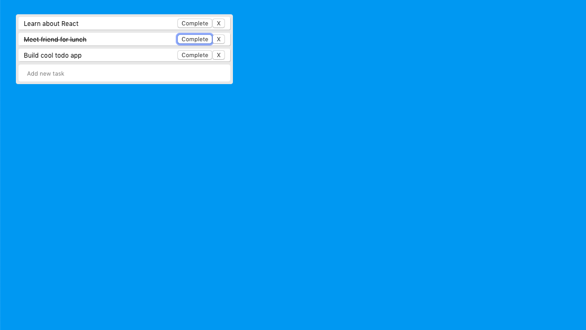

# React Todo App

Add, mark as complete, and delete your daily tasks.

## Usage

```bash
Right click the 'src' folder and use "open in terminal".
Run "npm start" to open the app in your browser.
```

## Screenshots

```python



```

## Contributing
Thanks to Traversy Media for providing the tutorial for this app. Click the link below to visit his channel.

https://www.youtube.com/watch?v=mxK8b99iJTg&t=962s
